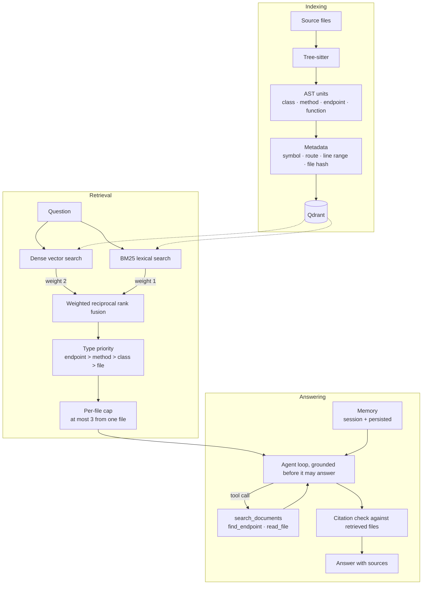

# Local AI Code Agent

Ask questions about a codebase and get answers grounded in its actual source.
Indexing is AST-aware, retrieval is hybrid (dense + BM25), and every file the
answer cites is checked against what was really retrieved.

Runs entirely on your machine against [Ollama](https://ollama.com/) and an
embedded Qdrant. No API key, no code leaves the box.


*A real session, unedited: indexing 118 chunks from 28 files, then a question
and a follow-up that depends on the previous turn.*

## Does it work?

Measured against [spring-petclinic](https://github.com/spring-projects/spring-petclinic)
(pinned revision, 118 chunks) with the 80 questions in
`evaluation/retrieval_cases.json`, at k=5:

| Configuration | Recall@5 | MRR |
| --- | --- | --- |
| Vector only | 63.7% | 0.434 |
| BM25 only | 38.8% | 0.247 |
| **Hybrid (shipped)** | **67.5%** | **0.453** |

| Category | n | Vector | Hybrid |
| --- | --- | --- | --- |
| endpoint | 16 | 93.8% | 87.5% |
| config | 6 | 83.3% | 83.3% |
| data | 9 | 44.4% | **77.8%** |
| model | 18 | 61.1% | 66.7% |
| class | 15 | 53.3% | 60.0% |
| method | 14 | 42.9% | 35.7% |

Reproduce it:

```bash
./scripts/fetch_eval_corpus.sh
python3 -m scripts.evaluate_retrieval .eval-corpus/spring-petclinic/src/main
```

### What the numbers cost to get right

This suite began as 30 questions, on which the same system scored **86.7%**.
That number was wrong — not miscalculated, but measured on a set too small and
too easy to be informative. One case was worth 3.3 points, so no change smaller
than roughly ten points could be distinguished from noise.

Expanding to 80 harder questions dropped the score to 60.0% and revealed
something the small set had hidden: **fusing the two retrievers as equals was
performing worse than dense search alone** (60.0% against 63.7%). BM25 is
markedly weaker on this corpus, and giving it an equal vote was actively
harmful.

Two changes followed, and their parameters were chosen on a random half of the
questions and then validated on the half held back: weighting dense search
twice as heavily as BM25, and capping how many results any single file may
contribute. On the 35 unseen questions that was worth **+8.6 points of recall**.

The trade-off is visible in the table above and is not hidden: capping per file
costs a little on endpoint and method questions, where the answer is genuinely
the fourth unit inside one large controller, and buys a great deal on data,
class, and model questions that a single crowded file used to bury.

## Quick start

Python 3.10+ and Ollama.

```bash
python3 -m venv venv && source venv/bin/activate
pip install -e '.[dev]'

ollama serve
ollama pull nomic-embed-text
ollama pull qwen2.5-coder:3b

code-agent
```

```text
load /absolute/path/to/a/codebase
Where is authentication handled?
exit
```

Copy `.env.example` to `.env` to change the Ollama endpoint, models, timeout, or
index location.

### HTTP API

```bash
pip install -e '.[api]'
uvicorn app.api:app
```

`POST /query` returns the answer **and the source it was grounded on**, so the
claim can be checked against the code rather than taken on trust:

```json
{
  "answer": "Owners are created at /owners/new ...",
  "sources": [
    {
      "file": "OwnerController.java",
      "lines": "77-88",
      "type": "endpoint",
      "name": "processCreationForm",
      "endpoint": "/owners/new",
      "http_method": "POST"
    }
  ]
}
```

`POST /index` indexes a path; `GET /health` reports how many chunks are indexed.
Interactive docs at `/docs`.

### Docker

```bash
WORKSPACE=/path/to/your/code docker compose up --build
curl -X POST localhost:8000/index -H 'Content-Type: application/json' \
  -d '{"path": "/workspace"}'
```

The image runs the agent only and reaches Ollama on the host. Running Ollama
*inside* a container on macOS gives up Metal and falls back to CPU, which is the
difference between ~13 tok/s and unusable — so it is offered as an opt-in
`--profile bundled-ollama` for Linux hosts rather than being the default.

## How it works



Three decisions carry most of the quality:

**Embed AST units, not character windows.** A function is already a meaningful
retrieval unit; slicing it into 1200-character windows discards the structure
the parser just recovered. Units are embedded whole and split only when they
exceed the embedding budget, at line boundaries.

**Fuse two retrievers, but not as equals.** Embeddings handle paraphrase and
drift on exact identifiers; BM25 does the reverse. Their rankings are combined
with reciprocal rank fusion, which works on ranks and so sidesteps the fact that
cosine similarity and BM25 scores are not comparable. Dense search is weighted
twice as heavily, because it measurably earns it on this corpus — weighting them
equally made the combination worse than dense search alone.

**Ground before answering, then verify.** The agent retrieves before its first
model call — left to decide for itself it answers from parametric knowledge and
invents plausible paths. Afterwards, every cited file name is checked against
what was actually retrieved, and anything unverified is flagged rather than
silently removed.

## Indexing behaviour

Re-indexing only touches what changed, keyed on a SHA-256 per file:

| Operation | Files changed | Chunks embedded | Time |
| --- | --- | --- | --- |
| Full index | 28 | 118 | 7.7s |
| Re-index, nothing changed | 0 | 0 | 0.0s |
| Re-index, one file touched | 1 | 5 | 0.3s |

Point IDs are a UUID5 over (path, type, name, part), so re-indexing a file
replaces its own chunks instead of duplicating them.

## Quality checks

```bash
ruff check .
pytest --cov
```

100 tests, fully offline — a conftest fixture refuses real HTTP, so a
half-mocked test fails immediately instead of passing on whichever machine
happens to have Ollama running. CI runs on Python 3.10, 3.11 and 3.12 with
coverage held at 75%.

## Known limitations

- Only Python and Java have AST extractors, and Python extracts functions but not classes. C/C++, JavaScript, TypeScript, Markdown and text files are indexed whole.
- The BM25 index is held in memory and rebuilt from the vector store on first query.
- The Qdrant client takes an exclusive lock on the index directory, so the CLI and the HTTP API cannot run at the same time.
- Answer quality is bounded by the local model. Citations are verified, so an invented file name is flagged rather than asserted, but the surrounding prose is only as good as the model — see below.

### Choosing a model

Pick a model that fits **entirely** in your GPU budget, including its KV cache.
Partial offload is not graceful degradation — on unified memory it is a cliff.

Measured on an 8 GB M1 (~5.3 GiB usable), same prompt, same 120 generated tokens:

| Model | Resident size | Placement | Generation | Wall clock |
| --- | --- | --- | --- | --- |
| `mistral` (7B) | 5.1 GB | 10% CPU / 90% GPU | 0.9 tok/s | 143.7s |
| `qwen2.5-coder:3b` | 2.2 GB | **100% GPU** | **12.7 tok/s** | **13.9s** |

The 7B exceeds the budget by a few hundred megabytes once its cache is
allocated, and the 10% that spills to CPU costs roughly 14x in throughput. The
3B is both faster and more accurate here, being code-specialised: answers went
from citing invented paths to quoting real source with line numbers.

Check placement with `ollama ps`; anything other than `100% GPU` is the first
thing to fix. On a larger GPU, `qwen2.5-coder:7b` is a reasonable upgrade.

## Roadmap

- Python class extraction, to match the Java side.
- Call graph extraction (controller -> service -> repository).
- More language extractors.

## Project story

Built to practise retrieval-system engineering end to end: AST parsing and
metadata extraction, local model integration, vector and lexical indexing,
deterministic evaluation, and a tested product with two interfaces. Every
performance and quality claim above is a number this repository can reproduce,
which is deliberate — the interesting work was measuring what actually helped,
not assuming it.
