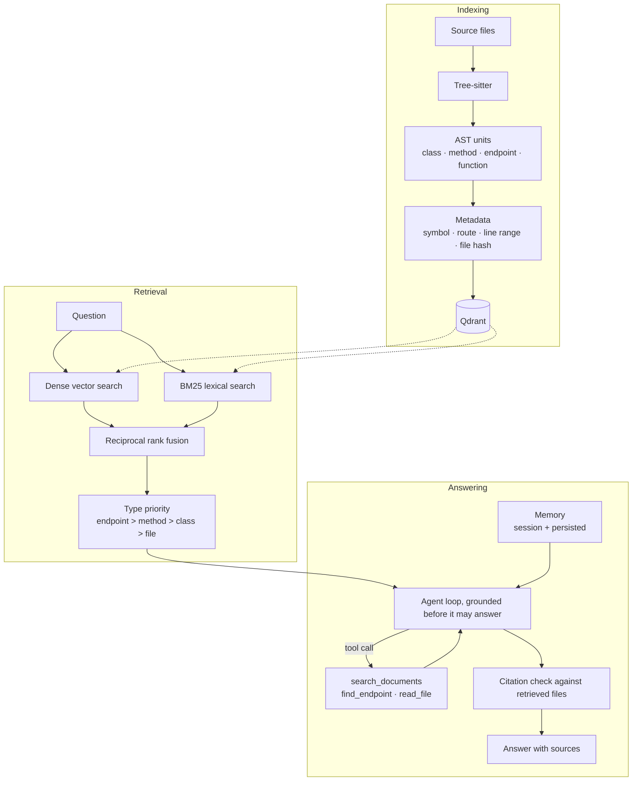

# Local AI Code Agent

Ask questions about a codebase and get answers grounded in its actual source.
Indexing is AST-aware, retrieval is hybrid (dense + BM25), and every file the
answer cites is checked against what was really retrieved.

Runs entirely on your machine against [Ollama](https://ollama.com/) and an
embedded Qdrant. No API key, no code leaves the box.


*A real session, unedited: indexing 118 chunks from 28 files, then a question
and a follow-up that depends on the previous turn.*

## Does it work?

Measured against [spring-petclinic](https://github.com/spring-projects/spring-petclinic)
(pinned revision, 118 chunks) with the 30 questions in
`evaluation/retrieval_cases.json`, at k=5:

| Configuration | Recall@5 | MRR |
| --- | --- | --- |
| Vector only | 76.7% | 0.594 |
| BM25 only | 50.0% | 0.354 |
| **Hybrid (shipped)** | **86.7%** | **0.662** |

Endpoint-navigation questions reach **100% Recall@5**. The starting point —
character-window chunking with keyword reranking — scored 70.0% / 0.503, so
hybrid retrieval over whole AST units is worth **+16.7 points of recall and
+32% MRR**.

Reproduce it:

```bash
./scripts/fetch_eval_corpus.sh
python3 -m scripts.evaluate_retrieval .eval-corpus/spring-petclinic/src/main
```

A sweep over fusion parameters found no setting that reliably beat the
defaults, so the shipped constants are the standard ones rather than values
fitted to this question set.

## Quick start

Python 3.10+ and Ollama.

```bash
python3 -m venv venv && source venv/bin/activate
pip install -e '.[dev]'

ollama serve
ollama pull nomic-embed-text
ollama pull qwen2.5-coder:3b

code-agent
```

```text
load /absolute/path/to/a/codebase
Where is authentication handled?
exit
```

Copy `.env.example` to `.env` to change the Ollama endpoint, models, timeout, or
index location.

### HTTP API

```bash
pip install -e '.[api]'
uvicorn app.api:app
```

`POST /query` returns the answer **and the source it was grounded on**, so the
claim can be checked against the code rather than taken on trust:

```json
{
  "answer": "Owners are created at /owners/new ...",
  "sources": [
    {
      "file": "OwnerController.java",
      "lines": "77-88",
      "type": "endpoint",
      "name": "processCreationForm",
      "endpoint": "/owners/new",
      "http_method": "POST"
    }
  ]
}
```

`POST /index` indexes a path; `GET /health` reports how many chunks are indexed.
Interactive docs at `/docs`.

## How it works



Three decisions carry most of the quality:

**Embed AST units, not character windows.** A function is already a meaningful
retrieval unit; slicing it into 1200-character windows discards the structure
the parser just recovered. Units are embedded whole and split only when they
exceed the embedding budget, at line boundaries.

**Fuse two retrievers rather than trusting one.** Embeddings handle paraphrase
but drift on exact identifiers; BM25 nails `OwnerRepository` but cannot bridge
vocabulary. Their rankings are combined with reciprocal rank fusion, which
works on ranks and so sidesteps the fact that cosine similarity and BM25 scores
are not comparable.

**Ground before answering, then verify.** The agent retrieves before its first
model call — left to decide for itself it answers from parametric knowledge and
invents plausible paths. Afterwards, every cited file name is checked against
what was actually retrieved, and anything unverified is flagged rather than
silently removed.

## Indexing behaviour

Re-indexing only touches what changed, keyed on a SHA-256 per file:

| Operation | Files changed | Chunks embedded | Time |
| --- | --- | --- | --- |
| Full index | 28 | 118 | 7.7s |
| Re-index, nothing changed | 0 | 0 | 0.0s |
| Re-index, one file touched | 1 | 5 | 0.3s |

Point IDs are a UUID5 over (path, type, name, part), so re-indexing a file
replaces its own chunks instead of duplicating them.

## Quality checks

```bash
ruff check .
pytest --cov
```

91 tests, fully offline — a conftest fixture refuses real HTTP, so a
half-mocked test fails immediately instead of passing on whichever machine
happens to have Ollama running. CI runs on Python 3.10, 3.11 and 3.12 with
coverage held at 75%.

## Known limitations

- Only Python and Java have AST extractors, and Python extracts functions but not classes. C/C++, JavaScript, TypeScript, Markdown and text files are indexed whole.
- The BM25 index is held in memory and rebuilt from the vector store on first query.
- The Qdrant client takes an exclusive lock on the index directory, so the CLI and the HTTP API cannot run at the same time.
- Answer quality is bounded by the local model. Citations are verified, so an invented file name is flagged rather than asserted, but the surrounding prose is only as good as the model — see below.

### Choosing a model

Pick a model that fits **entirely** in your GPU budget, including its KV cache.
Partial offload is not graceful degradation — on unified memory it is a cliff.

Measured on an 8 GB M1 (~5.3 GiB usable), same prompt, same 120 generated tokens:

| Model | Resident size | Placement | Generation | Wall clock |
| --- | --- | --- | --- | --- |
| `mistral` (7B) | 5.1 GB | 10% CPU / 90% GPU | 0.9 tok/s | 143.7s |
| `qwen2.5-coder:3b` | 2.2 GB | **100% GPU** | **12.7 tok/s** | **13.9s** |

The 7B exceeds the budget by a few hundred megabytes once its cache is
allocated, and the 10% that spills to CPU costs roughly 14x in throughput. The
3B is both faster and more accurate here, being code-specialised: answers went
from citing invented paths to quoting real source with line numbers.

Check placement with `ollama ps`; anything other than `100% GPU` is the first
thing to fix. On a larger GPU, `qwen2.5-coder:7b` is a reasonable upgrade.

## Roadmap

- Python class extraction, to match the Java side.
- Call graph extraction (controller -> service -> repository).
- More language extractors.

## Project story

Built to practise retrieval-system engineering end to end: AST parsing and
metadata extraction, local model integration, vector and lexical indexing,
deterministic evaluation, and a tested product with two interfaces. Every
performance and quality claim above is a number this repository can reproduce,
which is deliberate — the interesting work was measuring what actually helped,
not assuming it.
